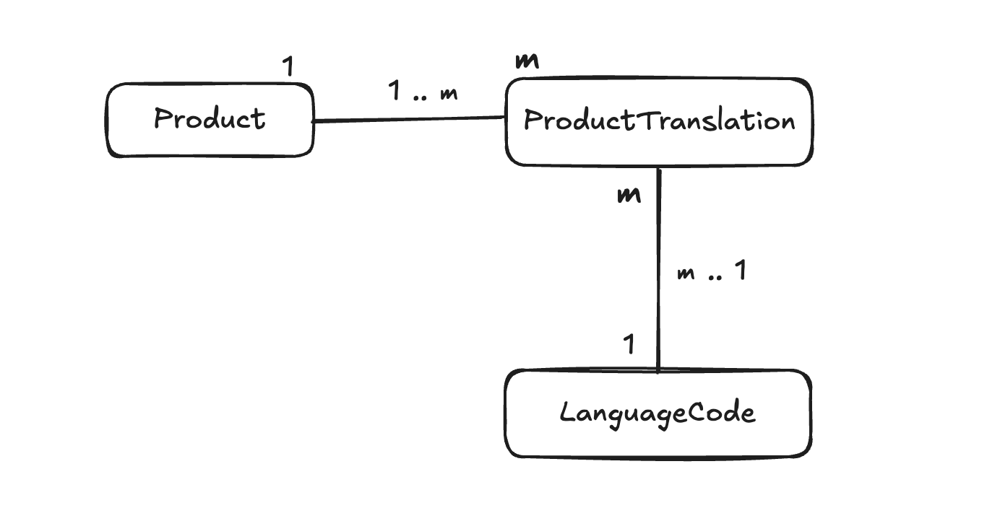

<p align="center">
  <a href="http://nestjs.com/" target="blank"></a>
</p>

#### Index

- [Project Setup](#setup)
- [API Documentation](#api-documentation)
- [Additional Requirements](#additional)

## <a name='setup'>Project setup</a>

```bash
$ npm install

$ docker compose up -d

# make sure that docker is running before migration.
$ npm run migration:run

# start application.
$ npm run start:dev
```

## <a name='api-documentation'>API Documentation</a>

1.  GET `/product/search` : For searching product by name.<br/><br/>
      Params :
      - name : Search keyword for product name, compatible with every language.
      - page (optional) : page offset.
      - size (optional) : page size.
      <br/>

      Response example :


        [
          {
            "id": 2,
            "langCode": {
              "code": "th"
            },
            "name": "แมว",
            "description": "มี 50 ขา",
            "product": {
              "id": 2,
              "price": 320
            }
          }
        ]
      <br/>

2. POST `/product` : For creating a product with it's translation. (Note: languageCode will autonomously created if not existed in the database)<br/><br/>


      Body example :


        {
          "price": 320,
          "productDetails": [
            {
              "name": "Dog",
              "description": "Has four legs",
              "languageCode": "en"
            }
          ]
        }

      

## <a name='additional'>Additional Requirements</a>

1.  <b>Validation</b>: Outline how you will validate data inputs in both APIs to ensure data integrity.
    <br /><i>I will add ValidationPipeline in the controller of each path coupling with a validation library.
    This way the data input will be validated before usage. <br/>
    In this project, I am using `class-validator` since I am using NestJS, which used `class`. In my opinion, this makes type assignment easier.
    </i>
    <br/>
2.  <b>Database Design</b>: Describe the database schema and the approach you will use to
    handle multilingual support for product information.
    <br/><i>I have designed database looking like in the diagram below :</i>
    

        <b>Product</b>: <i>collecting data related to the attribute of product (e.g. price, category, ...). <br/>In this test I only collected price to make structure not too complicate.</i><br/>
        <b>ProductTranslation</b>: <i>collects translations of product's name and description.</i><br/>
        <b>LanguageCode</b>: <i>collects language codes and the name of the language.<br/>I make this table to use in `ProductTranslation` to make it easier to distinguish between each translations.</i>
        <br/>

3.  <b>Testing Strategy</b>: Explain your strategy for testing these APIs, including how you
    will handle unit tests, integration tests, and any end-to-end testing considerations.
    <br/><i>For unit tests, I will use Jest to test functions to ensure that the function will works as expected without bug.<br/>
    For integration tests, if it is automated, I will use `Jest` with `SuperTest`, otherwise for manual integration test, I will use `Postman` or `curl`.<br/>
    Lastly for end-to-end testing, I will also use Jest with SuperTest, similar to integration test. However, I will setup a seperate test database to to run the full workflow.
        </i>
